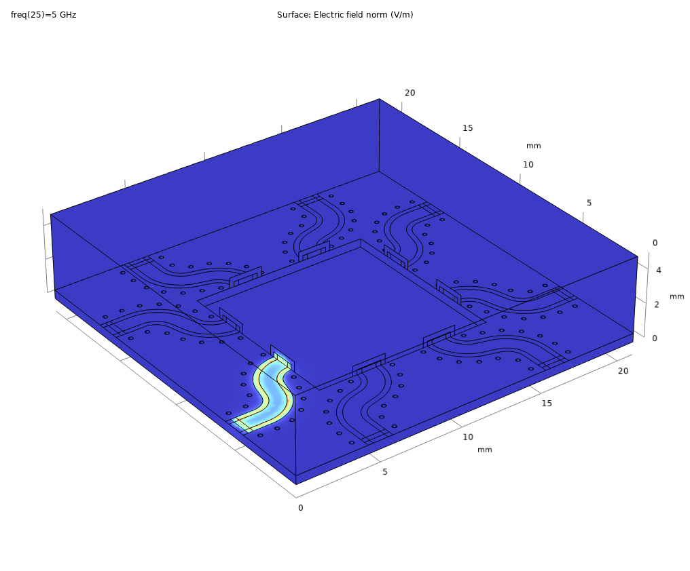
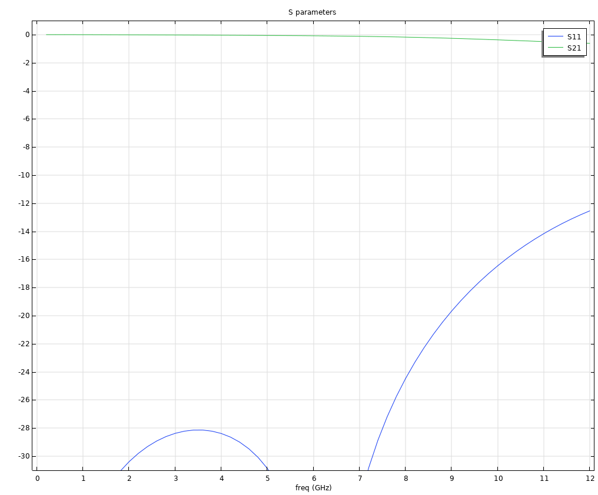

# QCD Box
This repository contains the **Design** and **Simulation** files of an 8-port sample box designed for 10x10 mm chips.

## Update:
* **20240918** Published V1.0 

## Description
### Box design in SOLIDWORKSTM
* **BOX.SLDASM** is the final assembly of the sample box.
* **BOX_A.SLDASM** and **BOX_B.SLDASM** are the cavity and the lid, respectively.
* **PCB.SLDASM** is the PCB with GCPW-type transmission lines.  
(This file is mainly for consistency check. The actual PCB design files should be found in the **PCB** folder.)
* **Chip.SLDASM** is a fake 10x10 mm chip for consistency check.
* **SMA.SLDASM** is a fake SMA connector for consistency check.

\* The **Technical** subfolder contains the .IGS, .SLDDRW, and .pdf files for production.

### PCB design in KiCADTM
* **PCB_240916.gds** is the GDSII file designed by a homemade PythonTM package pyads.
* **gerber** subfolder contains the gerber files genereted by Keysight ADSTM.
* The rest of the files are generated by KiCADTM.

\* The **.zip** file is for production.

### Box simulation in COMSOLTM
* **COMSOL_Eigenmode_Box.mph** simulates the bare box mode. The lowest eigenfrequency is found at 12.17 GHz.
* **COMSOL_Eigenmode_Full.mph** simulates the box mode with PCB, chip, and wire bonds.

\* The **Geometry** subfolder contains the simplified geometry for simulation.

### PCB simulation in Keysight ADSTM
* **QCDBox_wrk.zip** contains all the simulation files.

## Box design 
### Cavity
Given that the sample box will normally work in the 100MHz -- 8GHz range, we should minimize the box size to push the first box mode as high as possible. The flange size of the SMA connectors (12.9mm) determines the heightness of the box as 13 mm, as well as the thickness of the side wall as 4 mm. We also add r=3mm fillet for the box.

The inner width of the box is chosen as 21 mm, which will leave a space of 5.5 mm for wire bounding, assuming that an 10x10 mm chip is used. This space should be enough considering that the heightness of the side walls is around 6.5mm. We also add r=2mm fillet for the cavity.

We observe from the simulation that it is useful to have an empty space in the lid to push the first box mode to an even higher frequency. The optimal size of the empty space should be 2/3 of the cavity size, saying 14x14 mm, while the height is not crucial (we choose 3.3 mm). We also add r=2mm fillet for the empty space.

We also designed an empty space below the chip to push the bottom ground further way from the chip. The size is 9.5x9.5x3.5 mm in our design, leaving an 0.25 mm distance from the edge to mechanically support the chip. Besides, the chip is supported at the corners by the r=2mm fillet of this empty space.

### SMA connectors
To achieve the best impedance match between the SMA connectors and the PCB with minimum efforts, we choose the panel-mount connectors with flat pin. There are only several products of this type available in the market. We choose the M54FM0112F07C model from Micro RF Connector. The extruded pin is 0.8mm-wide and 1.5mm-long, which will determine the launch pad design of the PCB.

The connector has an 0.8mm-diameter 4mm-long impedance-matched extension that can be inserted into the box. They are mounted to the box through 16 M2x4 screws in total. 

\* The center conductor is gold plated BeCu, which might be slightly magnetic because of Be and Ni in the ENIG process. It is also possible to customize the materials by contacting the company.

### Mounting holes
The box and the lid is assembled with 9 M3x6 screws that are evenly spaced along the edges with an 3mm offset. Owing to the compact size, they are designed as through holes that can be used for mounting the sample box to the cryostat from the back side. 

In addition, we designed 4 addition M3 threads with 3.5mm depth from the back side to faciliate the sample mounting. A dedicated mounting plate can be used if necessary.

The PCB is mounted inside the cavity via 4 M2x3 screws. Brass may be a good choice of these screws as they provide strength as well as electrical and thermal condictivities among the surfaces of the PCB and the bulk cavity.

\* Silver paste may be used to improve the electrical and thermal conductivity.

## PCB design 
### GCPW design
We choose ROGERSTM 4350B as the PCB material which has a typical relative dielectric constant of 3.66. According to ROGERSTM online MWI Calculator, the dielectric constant is 3.717 in the "wideband" setting when choosing the thickness as 0.508mm. At specific frequencies, such as 100MHz and 10GHz, the dielectric constant varies from 3.8 to 3.72, respectively. In this design, we choose the dielectric constant at 1GHz as our reference, which is 3.758.

The 0.508mm thickness is chosen for several considerations: The major reason is that a smaller thickness can hardly support the 1mm track width as requested by the SMA connector, assuming that GCPW structure is used. A larger thickness solves this problem, but will lead to a larger geometry that is not very convenient for the chip launcher (a=300um, b=180um). The 0.508mm thickness is a sweet point we found that fulfils our needs. In addition, it is also comparable to the thickness of the (675um).

Impedance (a=1.00 mm, b=0.69 mm)|Impedance 2 (a=0.56 mm, b=0.10 mm)
:---------:|:---------:
  |  

Using the ROGERSTM online MWI Calculator, we find two parameter settings that provide 50Ohm match. Close to the outer side of the PCB, we choose a=1.00mm and b=0.69mm for soldering the SMA connectors. We change the design to a=0.56mm and b=0.10mm after 1.5mm from the edge, where an additional 0.65mm taper is designed to connect the two geometries.

Although a bit skeptical on whether we need vias for such a short waveguide length, the simulation indicates a meaningful improvement of the scattering parameters with them. We choose the via diemeter as 0.2mm. The vias are 5mm offset from the outer edge of the waveguide slot, and they are evenly spaced by 8mm. In addition, we add vias on the horizontal, vertical, diagonal, and anti-diagonal lines to separate the 8 waveguides.

### PCB specification
We choose 2-layer PCB with 1oz copper (35um). The vias are not covered but with with 35um thickness of copper plating. We choose immersion sliver for surface finish because the standard process of gold plating would require Ni plating beforehand. 

We found in the simulation that metalization on the inner edges of PCB will significantly suppress the influence of PCB and chip on the box mode. We truncate the waveguide 0.1mm from the inner edges and 0.2mm from the outer edges to faciliate edge plating. The 4 screw holes of 2.2mm diameter are also edge plated.

## Box modes
The box-mode simulations are performed by eigenfrequency solver of COMSOLTM. We search for the eigenmodes around 5GHz with normal mesh size. The perfect electric conductor (PEC) condition is applied to the inner surface of the cavity, all the surfaces of PCB, and the upper surface of the chip. In addition, we define 5 wirebonds on each edge of the chip.

<em>Fig. 1 Bare box modes. Note that the box is upside down.</em>  
We first simulate the bare box modes without the PCB and the chip, as shown in Fig. 1. The first 5 modes are observed at 11.524GHz, 15.838/15.841GHz, and 18.845/18.847GHz. This result indicates that the 21mmx21mm is suitable for our needs of operating the box in the 100MHz-8GHz range.

<em>Fig. 2 Box modes with PCB, chip, and wirebonds. Note that the box is upside down</em>  
Next, we add the PCB, chip, and the wirebonds for simulation. The simulation results are summarized in Fig. 2. 

The first 5 modes are observed at 11.524GHz, 15.838/15.841GHz, and 18.845/18.847GHz. This result indicates that the 21mmx21mm is suitable for our needs of operating the box in the 100MHz-8GHz range.

* **Co-simulation of the box mode** is performed by adding the PCB and the chip into the cavity. The relative permittivity of the PCB and the chip are defined as 3.717 and 12.9, respectively. The (i) PCB top surface, (ii) PCB bottom surface, and (iii) chip top surface are defined as PEC. 
It is worth mentioning that a dense wirebonding between the chip ground and the PCB ground is important in the co-simulation. A floating chip ground will cause a significant drop of the bare box mode. In our simulation, we define the wirebonds as 

### Simulation results

 | 

The transmission loss is kept below 1 dB, while the crosstalk between different ports is less than 30 dB. However, the impedance seems to be 10 $\Omega$ mismatched at 10 GHz (should debug it).

## PCB characteristics

## Mounting procedure:

Glue PCB with silver paste and put soldering paste to the edges of the GPCW track. 

Insert the SMA connectors into the holes on the side wall and tighten them with 2 x M2 screws each. 

Adjust the PCB so that the pin matches the track, and then tighten the PCB with 4 x M2 screws.

Use solder ion to tough each pin to melt the solder paste (hot plate?).

## Acknowledgement:
We are delighted if you find this project helpful to your own study. Feel free to contact us if you have questions, suggestions, criticisms, etc. You are free to copy, share, and build on this project without notifying the authors. Citing our publications is appreciated but not required. 
