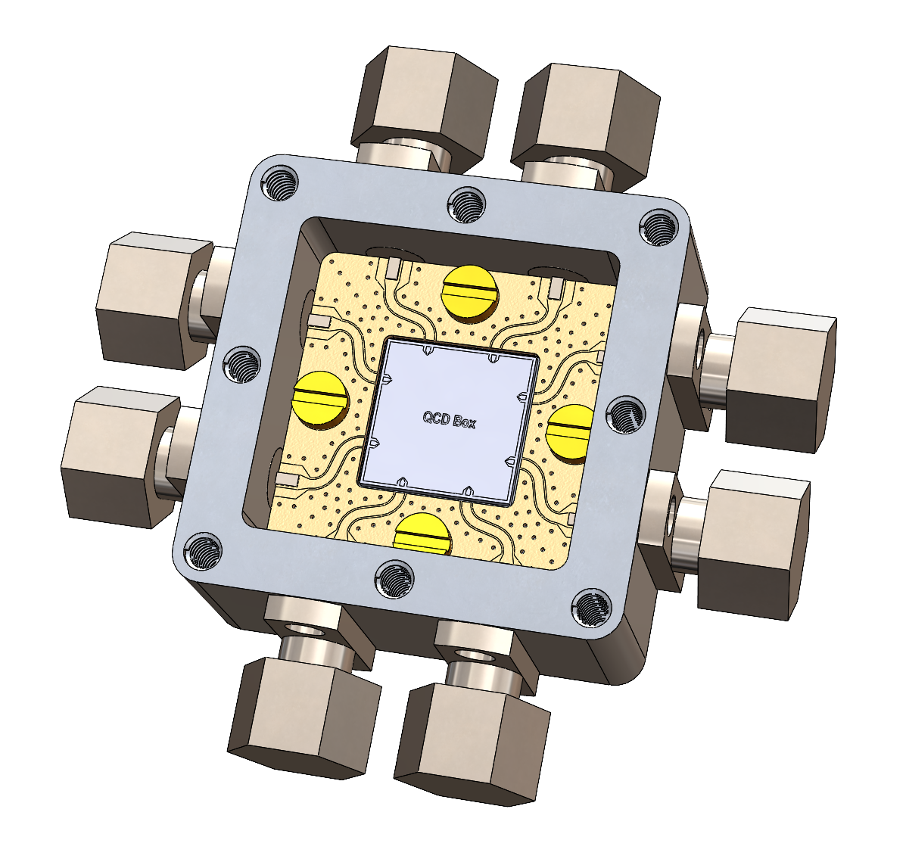

# QCD Box
This repository contains the **design files** and **simulation files** of an 8-port sample box designed for 10x10 mm chips.

## Related works:

## Description
### Design files in SOLIDWORKSTM
* **BOX.SLDASM** is the final assembly of the sample box.
* **BOX_A.SLDASM** and **BOX_B.SLDASM** are the box and the lid, respectively.
* **PCB.SLDASM** is the PCB with GCPW-type transmission lines.
* **Chip.SLDASM** is a fake 10x10 mm chip for consistency check of the geometry.
* **SMA.SLDASM** is a fake SMA connector for consistency check of the geometry.

\* For non-SOLIDWORKS users, you can check the geometry from the corresponding **.step** files.

### Simulation files in COMSOLTM
* **Box_eigenmode.mph** simulates the box mode around 10 GHz. The lowest eigenfrequency is found at 12.17 GHz.
* **PCB_frequencydomain.mph** simulates the scattering coefficients and the input impedance of the PCB ports. 

## Box design 
### Cavity

### Lid

### SMA connectors
To achieve the best impedance match between the SMA connectors and the PCB with minimum efforts, we choose the panel-mount connectors with flat pin. There are only several products of this type available in the market. We choose the M54FM0112F07C model from Micro RF Connector, which has an 0.8mm-diameter 4mm-long impedance-matched extension that can be conveniently inserted into the box. The extruded pin is 0.8mm-wide and 1.5mm-long, which will determine the launch pad design of the PCB. 

\* This connector is likely not non-magnetic.

### Mounting holes
The box and the lid is assembled with 9 x M2.5 screws that are evenly spaced on the side walls. Owing to the compact size, the corresponding holes are designed as through holes to be mutiplexed for mounting the sample box to the cryostat. 

\* A dedicated mounting plate can be used if necessary.

The PCB is mounted inside the cavity via 4 x M2 screws with a length of 3mm. Brass may be a good choice of these screws as they provide strength as well as electrical and thermal condictivities.

\* Silver paste can be used to improve the electrical and thermal conductivity between the PCB and the box.

### Simulation results

## PCB design
### GCPW parameters
We choose ROGERSTM 4003C as the PCB material which has a typical relative dielectric constant of 3.55. Given a thickness of 0.508 mm, the track and gap widths are chosen as 0.9 mm and 0.3 mm, respectively, for achieving an 50 $\Omega$ characteristic impedance. This track width is convenient for soldering the SMA connectors. We also added 0.25 mm-diameter vias with 1 mm separation to improve the high-frequency performance of the GCPW.

\* The calculation of characteristic impedance is made by MWI Calculator provided by ROGERSTM* [see **RO4003C.png** for detail].

### Simulation results

## Mounting procedure:

## Acknowledgement:
We are delighted if you find this project helpful to your own study. Feel free to contact us if you have questions, suggestions, criticisms, etc. You are free to copy, share, and build on this project without notifying the authors. Citing our publications is appreciated but not required. 
