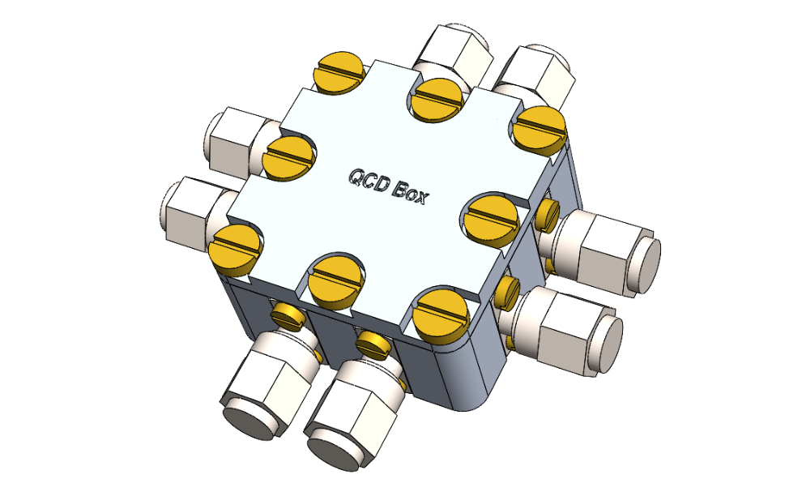

# QCD Box
This repository contains the **Design** and **Simulation** files of an 8-port sample box developed at QCD Labs. It is designed for 10x10 mm chips. Other chip sizes would require minor modifications of the design files, namely, the PCB and the under-chip cavity. However, chips larger than 13x13mm may encounter wire bonding difficulties.

## Update:
* **20240919** Published V1.0 

## Description
### Box design in SOLIDWORKSTM
* **Box.SLDASM** is the final assembly of the sample box.
* **Bottom.SLDASM** and **Top.SLDASM** are the bottom and top parts, respectively.
* **PCB.SLDASM** is the PCB with GCPW-type transmission lines.  
(This file is mainly for consistency check. The actual PCB design files should be found in the **PCB** folder.)
* **SMA.SLDASM** is the SMA connector for consistency check.
* **Chip.SLDASM** is a fake 10x10 mm chip for consistency check.
* **M2_3.SLDASM**, **M2_4.SLDASM**, and **M3_6.SLDASM** are the corresponding screws for consistency check.

\* The **Technical** subfolder contains the .IGS, .SLDDRW, and .pdf files for production.

### PCB design in KiCadTM
* **PCB_240916.gds** is the GDSII file designed by a homemade PythonTM package (pyads).  
(pyads is still in the debugging phase and not available to the public at the current time.)
* **gerber** subfolder contains the gerber files.
* The rest of the files are generated by KiCadTM.

\* The **.zip** file is for production.

### Box simulation in COMSOLTM
* **COMSOL_Box.mph** simulates the bare box mode.
* **COMSOL_Full.mph** simulates the box mode with PCB, chip, and wire bonds.

\* The **Geometry** subfolder contains the simplified geometry for simulation.

### PCB simulation in Keysight ADSTM
* **QCDBox_wrk.zip** contains all the simulation files.

## Box design 
### Cavity
Bottom (front side)| Bottom (back side)
:---------:|:---------:
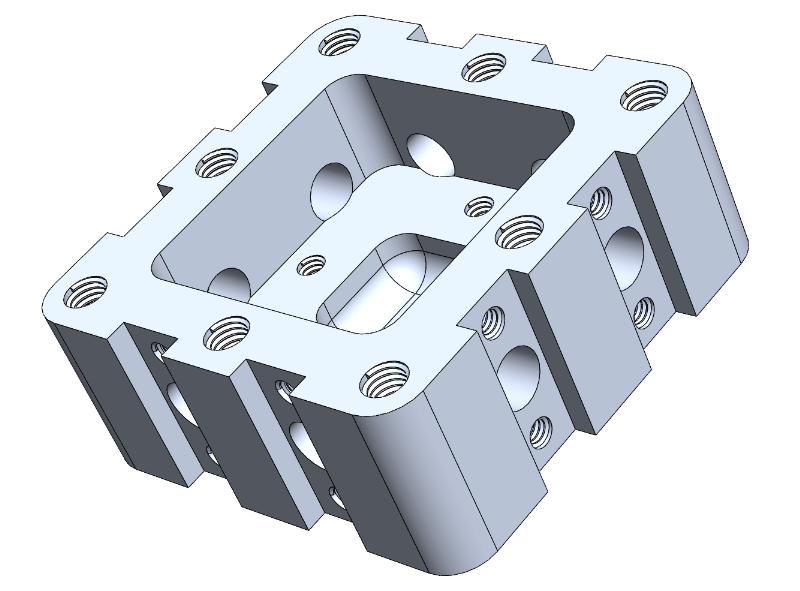  |  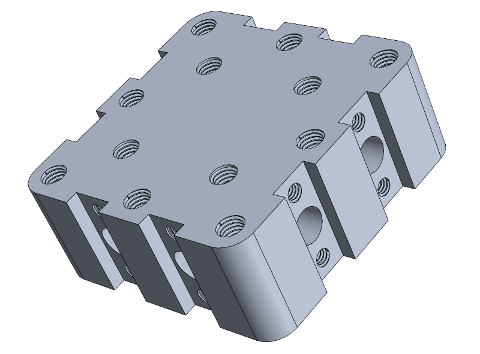

Given that the sample box will normally work in the 100MHz -- 8GHz range, we should minimize the box size to push the first box mode as high as possible. The flange size of the SMA connectors (12.9mm) determines the heightness of the box as 13 mm, while its coaxial extention determines the thickness of the side wall as 4 mm. In addition, we add r=3mm fillet for the box.

The inner width of the box is chosen as 21 mm. It will leave a space of 5.5 mm on each side for wire bounding assuming that an 10x10 mm chip is used. This space should be enough considering that the height of the side walls is around 6.5mm. We also add r=2mm fillet for the cavity.

We also designed an empty space below the chip to push the bottom ground further way from the chip. The dimension is 9.5x9.5x3.5 mm in our design, leaving an 0.25 mm distance from the edge to mechanically support the chip. In addition, the chip is supported at the corners by the r=2mm fillet of this under-chip cavity.

Top (front side)| Top (back side)
:---------:|:---------:
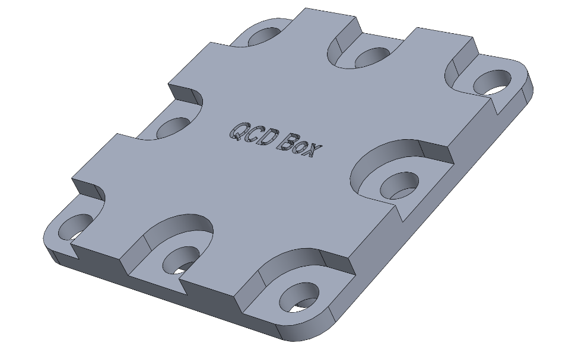  |  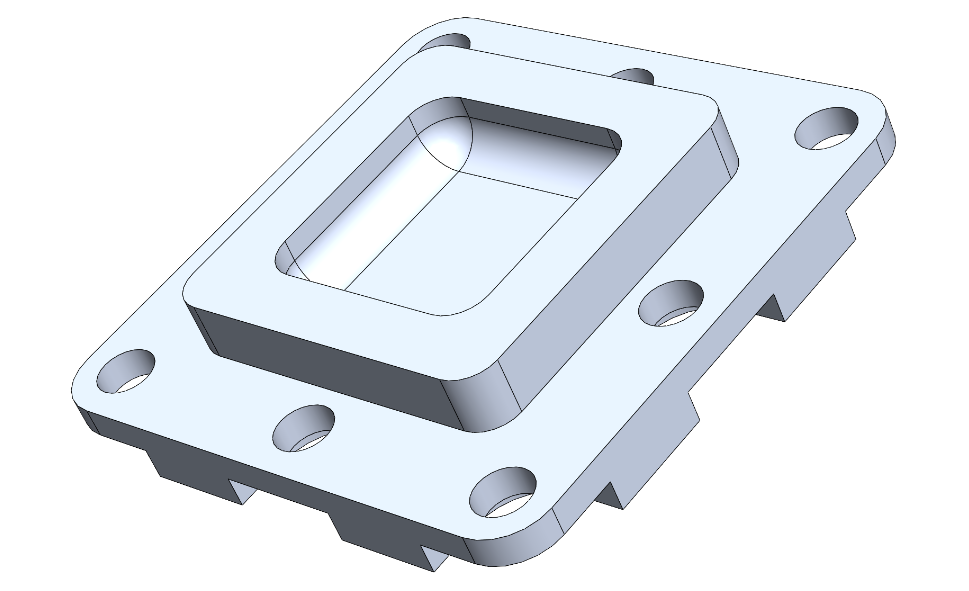

We observe from the simulation that it is useful to have an empty space in the lid to push the first box mode to an even higher frequency. The optimal size of the empty space should be 2/3 of the cavity size, saying 14x14 mm, while the height is not crucial (we choose 3.3 mm). We also add r=2mm fillet for this cavity.

### SMA connectors
To achieve the best impedance match between the SMA connectors and the PCB with minimum efforts, we choose the panel-mount connectors with flat pin. There are only several products of this type available in the market. We choose the M54FM0112F07C model from Micro RF Connector. The extruded pin is 0.8mm-wide and 1.5mm-long, which will determine the launch pad design of the PCB.

The connector has an 0.8mm-diameter 4mm-long impedance-matched extension that can be inserted into the box. They are mounted to the box through 16 M2x4 screws. 

\* The center conductor is gold plated BeCu, which might be slightly magnetic because of Be and the Ni in gold plating process. It may be possible to customize the materials by contacting the company.

### Mounting holes
The box and the lid are assembled with 9 M3x6 screws that are evenly spaced along the edges with an 3mm offset. Owing to the compact size, the threads are designed as through holes that can be used for sample mounting from the back side. 

In addition, we designed 4 addition M3 threads with 3.5mm depth from the back side to faciliate the mounting. A dedicated mounting plate can be used if necessary.

The PCB is mounted inside the cavity via 4 M2x3 screws. Brass may be a good choice of these screws as they provide strength, as well as electrical and thermal condictivities. It will ground the two faces of the PCB to the bulk cavity.

\* Silver paste may be used to improve the electrical and thermal conductivity between the bottom face of PCB and the bulk cavity.

## PCB design 
### GCPW design
We choose ROGERSTM 4350B as the PCB material, which has a typical dielectric constant of 3.66. According to ROGERSTM online MWI Calculator, the dielectric constant is 3.717 in the "wideband" setting when choosing the thickness as 0.508mm. At specific frequencies, such as 100MHz and 10GHz, it varies from 3.8 to 3.72, respectively. In this design, we choose the dielectric constant at 1GHz as our reference, which is 3.758.

The 0.508mm thickness is chosen for several considerations: The major reason is that a smaller thickness can hardly support the 1mm track width as requested by the SMA connector, assuming that GCPW structure is used. A larger thickness solves this problem, but will lead to a larger geometry that is not very compatible to the chip launcher (a=300um, b=180um). The 0.508mm thickness is a sweet point that fulfils our needs. An additional benefit is that it is comparable to the thickness of our chip (675um).

Impedance (a=1.00 mm, b=0.69 mm)|Impedance 2 (a=0.56 mm, b=0.10 mm)
:---------:|:---------:
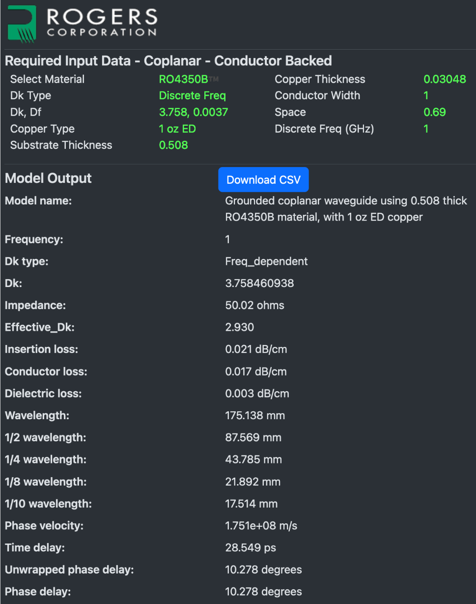  |  

Using ROGERSTM online MWI Calculator, we find two parameter settings that provide good 50Ohm match. Close to the outer side of the PCB, we choose a=1.00mm and b=0.69mm that is convenient for soldering the SMA connectors. We change the design to a=0.56mm and b=0.10mm after 1.5mm from the edge, where an additional 0.65mm taper is designed to connect the two geometries. This 2nd setting is comparable to the on-chip launchers and therefore convenient for wire bonding.

Although a bit skeptical on whether we need vias for such a short waveguide length, the simulation indicates a meaningful improvement of the scattering parameters with them. We choose the via diemeter as 0.2mm. They are 5mm offset from the outer edge of the waveguide slot, and evenly spaced by 8mm alongside the waveguide. In addition, we add vias on the horizontal, vertical, diagonal, and anti-diagonal lines to isolate the 8 waveguides.

PCB (front side)|PCB (back side)
:---------:|:---------:
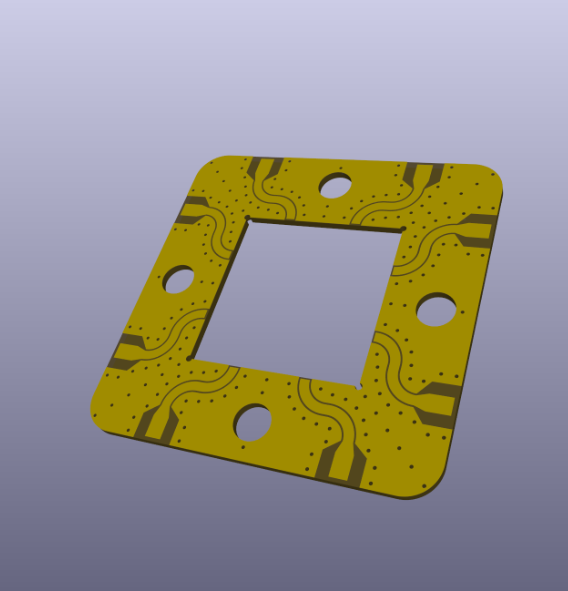  |  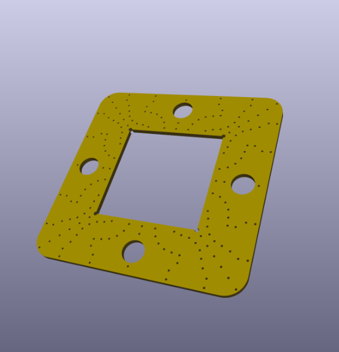

The layout is written by a homemade PythonTM package, pyads. It generates the layout in GDSII format, which can be further converted to gerber files for PCB production (via Keysight ADSTM). We find it useful to import the gerber files to KiCadTM for a 3D overview. Another benefit is that it can be directly linked to multiple online PCB producers to make the order.

### PCB specification
We choose 2-layer PCB with 1oz copper (35um). The vias are not covered but have 35um-thick copper plating. We choose immersion sliver for surface finish because the standard process of gold plating would require Ni plating beforehand. 

We find in the simulation that the existence of PCB and chip can pull the 1st box mode downwards by multiple gigahertz. This is in some sense unavoidable due to a finite gap between them. However, metalization on the inner edges of the PCB will significantly suppress this effect. We therefore truncate the waveguide 0.1mm from the inner edges and 0.2mm from the outer edges to faciliate edge plating. The 4 screw holes of 2.2mm diameter are also edge plated.

## Box modes
The box-mode simulations are performed by using the Eigenmode solver of COMSOLTM. We search for the eigenmodes around 5GHz with normal mesh size. The perfect electric conductor (PEC) condition is applied to the inner surface of the cavity, all the surfaces of PCB, and the upper surface of the chip. In addition, we define 5 wire bonds on each edge of the chip.  

<em>Fig. 1 Bare box modes. Note that the box is upside down.</em>  
We first search for the bare box modes without the PCB and the chip. The first 3 modes are observed at 11.524GHz, 15.838/15.841GHz, and 18.845/18.847GHz, as shown in Fig. 1. This result indicates that the 21mmx21mm cavity size is suitable for operating the box in the 100MHz-8GHz range.  

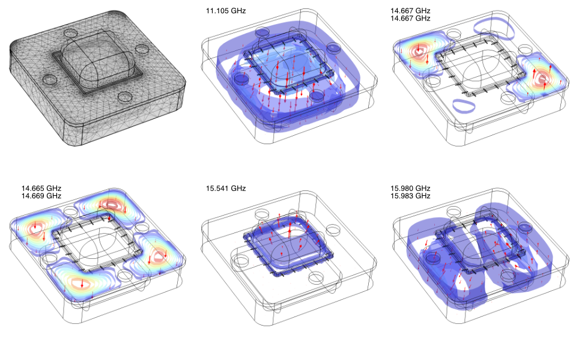
<em>Fig. 2 Box modes with PCB, chip, and wire bonds. Note that the box is upside down</em>  
Next, we add the PCB, chip, and the wire bonds for simulation. The results are summarized in Fig. 2. We find that the 1st mode is pulled down to 11.303GHz by introducing the PCB and the chip. The next 4 modes are observed at 11.910/11.912GHz, 14.551GHz, 14.665/14.667/14.669GHz, and 16.226/16.228GHz. Here, the first 2 modes are localized to the chip, the 3rd one is approximately the PCB mode, while the last one is reminiscent to the 2nd bare box mode.  

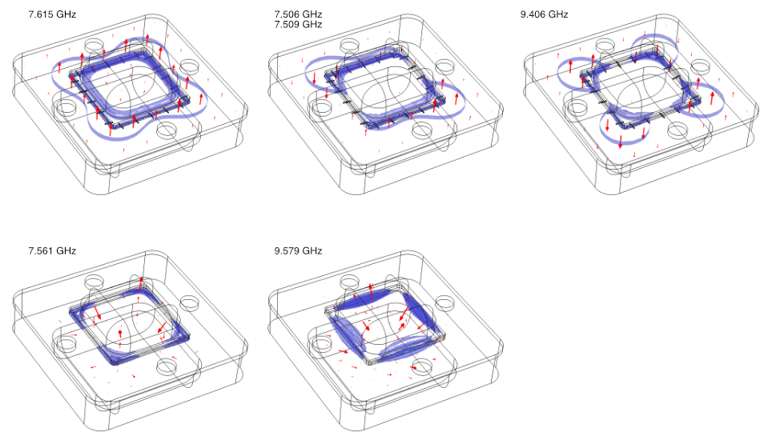
<em>Fig. 3 Box modes with a floating chip. The upper row has widebonds but not edge plating, while the lower row has edge plating but not wire bonds. Note that the box is upside down</em>  
We mentioned before that edge plating of the PCB is important to prevent a substential drop of the 1st box mode in the full simulation. Figure 3 shows the cases with only wire bonds and only edge plating. In both cases, the 1st box mode drops significantly to approximately 7.5GHz. However, the field profiles suggest different mechanisms for the drop: The mode spreads over the PCB in the former case, while it is mostly concentrated in the gap between PCB and the chip in the latter case. This observation reveals the importance of PCB edge plating. Fortunately, it is a standard technique in the PCB inductry.

## PCB characteristics
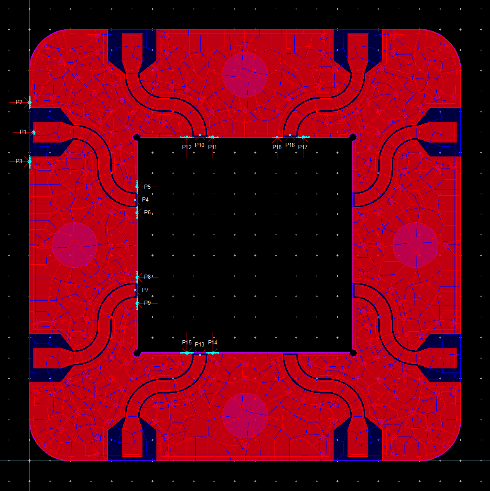
<em>Fig. 4 Mesh and port definition for PCB simulation.</em>  
The PCB simulations are performed by using the Momentum solver of Keysight ADSTM. We define the WN port as the inout port, while the rest as output ports. The pin edge size connected to the center conductor is 0.1mm, while it is 0.5mm when connected to the top-face ground.

We simulate the scattering coefficients of the WN waveguide, as well as its crosstalk to the nearest and next nearest waveguides. We perform the adaptive frequency sweep from 100MHz to 10GHz with maximamly 51 points. The mesh is defined at the highest simulation frequency with a density of 20 per wavelength. The automatic edge mesh is enabled and mesh reduction allowed.

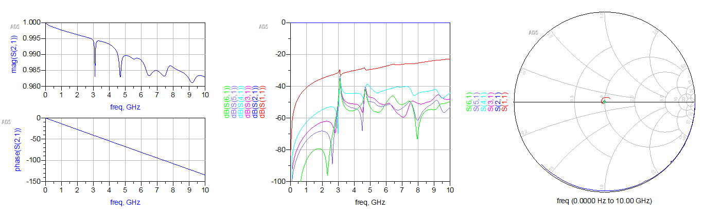
<em>Fig. 5 Scattering parameters.</em>  
Figure 5 summarizes the simulation results. The transmission and reflection rates of a single waveguide are -0.18dB and -22dB in the worst case, respectively. It indicates a good 50OHm impedance match, as can be also seen from the Smith chart. Moreover, the crosstalk between nearest and next nearest waveguides are approximately -50dB. 

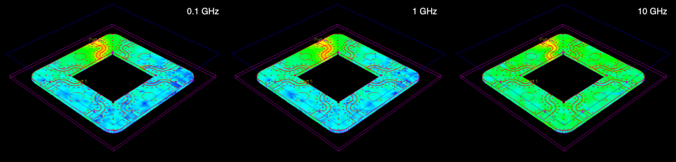
<em>Fig. 6 Current density in dB scale.</em>  
We observe impedance mismatches at 3, 4.7, 6.5GHz in the scattering coefficients. However, the current density profile does not show obvious difference at these frequencies. We note that this mismatch perturbes the transmission rate by less than 0.1%, although it may look huge in the dB scale. 

## Mounting procedure:
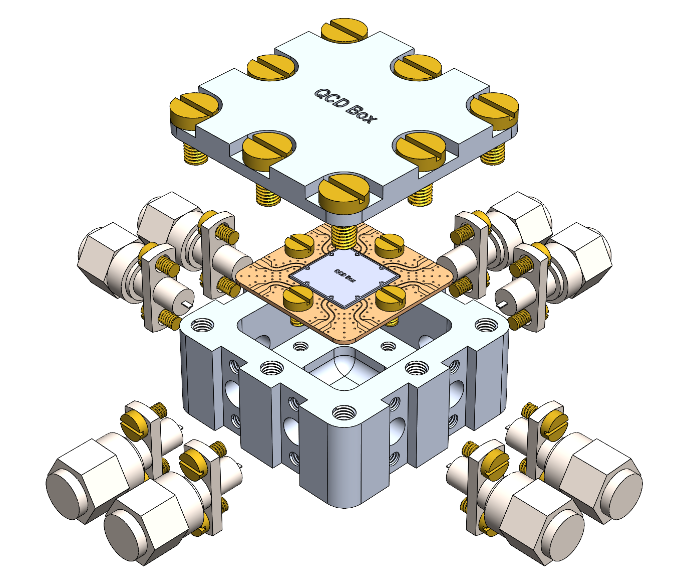

Spread a rather thin layer of silver paste on the backside of PCB.

Place PCB inside the cavity, align it to the center, and loosely mount it with the 4 M2x3 screws.

Spread the solder paste onto the waveguide tracks.

Insert the SMA connectors into the holes on the side wall and tighten them with M2x4 screws. 

Adjust the PCB so that the pin matches the track, and then tighten it with M2x3 screws.

Tough each pin with solder ion to melt the solder paste.

Use multimeter to check DC connection between the SMA pin and the waveguide.

## Acknowledgement:
We are delighted if you find this project helpful to your own study. Feel free to contact us if you have questions, suggestions, criticisms, etc. You are free to copy, share, and build on this project without notifying the authors. 
